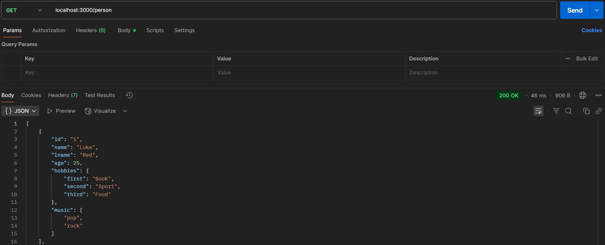

# Postman – Test API Without Frontend

**Postman** is a powerful tool that lets you send HTTP requests directly to your backend, without needing to build a frontend interface.

It’s especially useful when testing routes like `POST`, `PUT`, or `DELETE`, which you can't trigger by simply visiting a browser URL.

---

### Why Use Postman?

- Test all types of HTTP methods (`GET`, `POST`, `PUT`, `DELETE`, etc.)
- Send request **bodies** (e.g. JSON)
- Add headers, authentication tokens, or query params
- View detailed responses and status codes
- Great for debugging APIs while building them

---

### 🔧 Setup Example

Example server routes:

```js
const express = require("express");
const app = express();
const { person } = require("./person");

app.use(express.json());

app.get("/", (req, res) => {
  res.send("Homepage");
});

app.get("/person", (req, res) => {
  res.json(person);
});

app.post("/", (req, res) => {
  console.log(req.body); // Use Postman to send JSON
  res.send("ok post");
});

app.put("/", (req, res) => {
  console.log(req.body);
  res.send("ok put");
});

app.delete("/", (req, res) => {
  console.log(req.body);
  res.send("ok delete");
});
```

---

## 🚀 Step-by-Step Testing

1. **Create a new API request**

   - Choose method: `GET`, `POST`, `PUT`, etc.

   - Enter your URL, e.g. `http://localhost:3000/`

2. **Testing a GET request**

   - Just press "Send"

   - You should see JSON returned

   

3. **Testing a POST/PUT/DELETE**

   - Select `POST`, `PUT`, or `DELETE`

   - Go to the **Body** tab

   - Choose `raw` and select `JSON`

   - Write your data like:

     ```json
     {
       "user": "Luke Red",
       "email": "luke@email.com",
       "number": 333
     }
     ```

   
