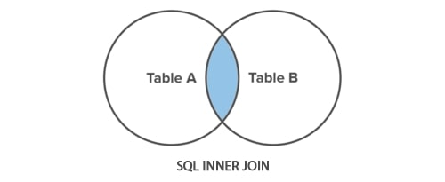
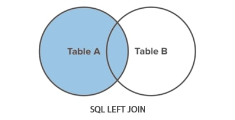
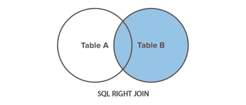
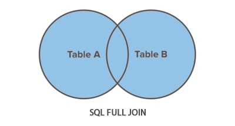
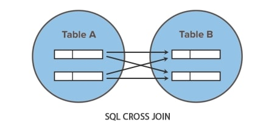

# SQL – 🔗 JOINs

In relational databases, **JOINs** allow you to combine rows from two or more tables based on a related column between them (usually a **foreign key**).

## Table of Contents

- [INNER JOIN](#inner)
- [LEFT JOIN](#left)
- [RIGHT JOIN](#right)
- [FULL JOIN](#full)
- [CROSS JOIN](#cross)

### 🧪 Example Tables

#### Employee

| employee\_id | first\_name | last\_name | hire\_date | salary | phone      | office\_id |
| ------------ | ----------- | ---------- | ---------- | ------ | ---------- | ---------- |
| 1            | Luke        | Red        | 2018-02-22 | 1500   | 2499856100 | 1          |
| 2            | Mark        | Grenn      | 2018-05-30 | 1300   | 0085834210 | 2          |
| 3            | Anne        | Black      | 2019-07-13 | 1700   | 2944101834 | 2          |
| 4            | Jack        | Purple     | 2019-08-01 | 1400   | 9854339500 | 4          |
| 5            | Marie       | Orange     | 2020-11-23 | 1350   | 5892033098 | 4          |
| 6            | Leonard     | Yellow     | 2020-12-11 | 1250   | 0092884712 | NULL       |

#### Office

| office\_id | office\_name     |
| ---------- | ---------------- |
| 1          | Administration   |
| 2          | Customer Service |
| 3          | Human Resources  |
| 4          | Sales            |

---

## 🔁 `INNER JOIN` {#inner}

Returns only the **matching rows** from both tables.

🟦 Think of it as the **intersection** of two sets.



```sql
SELECT employee.employee_id, employee.first_name, office.office_name
FROM employee
INNER JOIN office ON employee.office_id = office.office_id;
```

**Result:**

| employee\_id | first\_name | office\_name     |
| ------------ | ----------- | ---------------- |
| 1            | Luke        | Administration   |
| 2            | Mark        | Customer Service |
| 3            | Anne        | Customer Service |
| 4            | Jack        | Sales            |
| 5            | Marie       | Sales            |

→ Only rows with a matching `office_id` in both tables are shown (no Leonard).

---

## ⬅️ `LEFT JOIN` {#left}

Returns **all rows from the left table**, and the **matched rows from the right table**. Non-matching right-side values appear as `NULL`.

🟨 This is the **left set + intersection**.



```sql
SELECT employee.employee_id, employee.first_name, office.office_name
FROM employee
LEFT JOIN office ON employee.office_id = office.office_id;
```

**Result:**

| employee\_id | first\_name | office\_name     |
| ------------ | ----------- | ---------------- |
| 1            | Luke        | Administration   |
| 2            | Mark        | Customer Service |
| 3            | Anne        | Customer Service |
| 4            | Jack        | Sales            |
| 5            | Marie       | Sales            |
| 6            | Leonard     | NULL             |

→ All employees are shown, including Leonard who has no office assigned.

---

## ➡️ `RIGHT JOIN` {#right}

Returns **all rows from the right table**, and the **matched rows from the left table**. Non-matching left-side values appear as `NULL`.

🟩 This is the **right set + intersection**.



```sql
SELECT employee.employee_id, employee.first_name, office.office_name
FROM employee
RIGHT JOIN office ON employee.office_id = office.office_id;
```

**Expected Result:**

| employee\_id | first\_name | office\_name     |
| ------------ | ----------- | ---------------- |
| 1            | Luke        | Administration   |
| 2            | Mark        | Customer Service |
| 3            | Anne        | Customer Service |
| 4            | Jack        | Sales            |
| 5            | Marie       | Sales            |
| NULL         | NULL        | Human Resources  |

> ℹ️ **Note**: If you see multiple `NULL` entries for unmatched offices, check for table issues or repeated entries in your test environment. The correct result should show one unmatched row (Human Resources).

---

## 🔄 `FULL JOIN` {#full}



MySQL does **not** support `FULL JOIN` directly, but you can simulate it using a `UNION` of `LEFT JOIN` and `RIGHT JOIN`.

```sql
SELECT employee.employee_id, employee.first_name, office.office_name
FROM employee
LEFT JOIN office ON employee.office_id = office.office_id

UNION

SELECT employee.employee_id, employee.first_name, office.office_name
FROM employee
RIGHT JOIN office ON employee.office_id = office.office_id;
```

## `CROSS JOIN` {#cross}



Perfetto! Anche se il tutorial lo salta, ti fornisco una sezione concisa ma chiara su `CROSS JOIN`, in linea con il resto dei tuoi appunti. Puoi copiarla direttamente nel file Markdown:

---

## 🔄 `CROSS JOIN` {#cross}


A **CROSS JOIN** returns the **Cartesian product** of two tables — it combines every row from the first table with **every row** from the second table.

🧮 If table A has `m` rows and table B has `n` rows, the result will contain `m × n` rows.

> ⚠️ **Use with caution:** CROSS JOINs can create large datasets very quickly and are rarely used unless intentionally creating combinations (e.g., generating schedules or test data).

### 🛠 Example Use Case – Generating All Combinations

Imagine you are a café manager preparing for a coffee tasting event. You want to generate **all combinations** of available coffee types and cup sizes.

#### Tables

##### Coffee

| coffee\_type |
| ------------ |
| Espresso     |
| Americano    |
| Cappuccino   |

##### Size

| cup\_size |
| --------- |
| Small     |
| Medium    |
| Large     |

```sql
SELECT coffee.coffee_type, size.cup_size
FROM coffee
CROSS JOIN size;
```

**Result:**

| coffee\_type | cup\_size |
| ------------ | --------- |
| Espresso     | Small     |
| Espresso     | Medium    |
| Espresso     | Large     |
| Americano    | Small     |
| Americano    | Medium    |
| Americano    | Large     |
| Cappuccino   | Small     |
| Cappuccino   | Medium    |
| Cappuccino   | Large     |

> ✅ This use of `CROSS JOIN` makes sense: you want **all possible combinations** of two categories.
