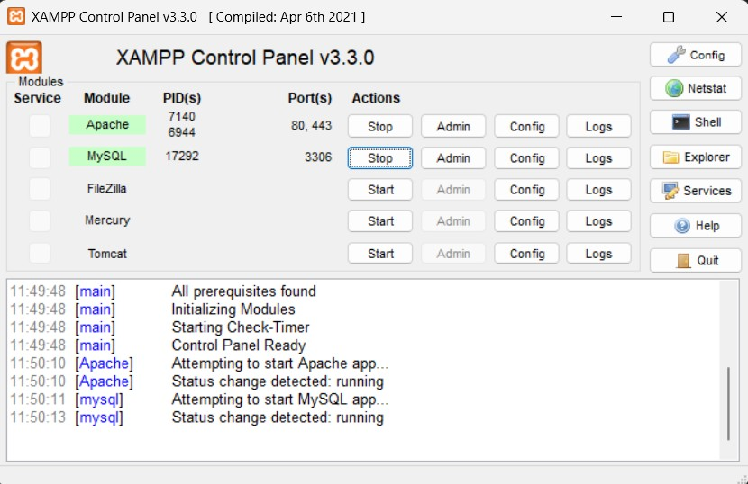
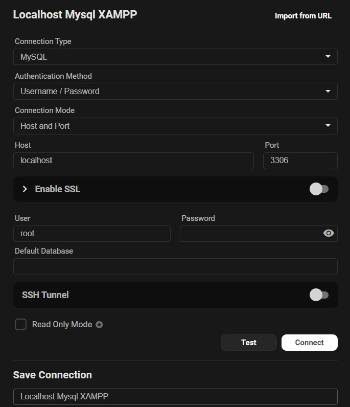

# SQL & Relational Databases

## What is SQL?

**SQL (Structured Query Language)** is a standardized programming language used to manage and manipulate relational databases. It allows you to:

- Query data
- Insert new records
- Update existing data
- Delete records
- Create or modify database structure (tables, views, etc.)

## What is a Relational Database?

A **relational database** organizes data into **tables** (also called "relations"), where each table has:

- **Rows**: each row is a record
- **Columns**: each column is a field/attribute with a specific data type

Tables can be connected using **relationships** (foreign keys), enabling structured and efficient data storage.

---

## 🧰 Environment Setup

### 🛠️ Installing XAMPP

**XAMPP** is a free, open-source software package that provides:

- **Apache** (web server)
- **MySQL/MariaDB** (database)
- **PHP** and **Perl**

> 📦 Useful for local development of dynamic websites and database testing.

#### Steps

1. Download and install XAMPP.
2. Open the XAMPP Control Panel & Start **Apache** and **MySQL**.
3. Check they are running by visiting:
   - `http://localhost/` or `127.0.0.1` (Apache test page)
   - `http://localhost/phpmyadmin` (phpMyAdmin interface for managing MySQL)

---

### 🖥️ Installing Beekeeper Studio

**Beekeeper Studio** is a modern and user-friendly SQL editor and database management tool.

#### Features

- Connect to various database types (MySQL, PostgreSQL, SQLite, etc.)
- Visual table browsing
- Execute SQL queries
- Save query history and connections

---

### 🔌 Connect Beekeeper Studio to Local MySQL

1. Open Beekeeper Studio.
2. Click on **"New Connection"**.
3. Select **"MySQL"**.
4. Enter the following info:
   - **Host**: `localhost`
   - **Username**: `root`
5. Click **"Test"** to check the connection.
6. If successful, click **"Connect"**.

