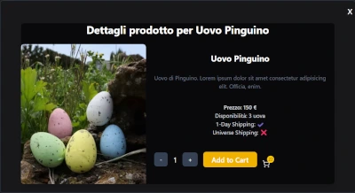

# Factory Project

Welcome to **Factory Project** – the weirdest online store where you can buy... eggs that don't exist.

This is a personal project I created to learn **React** by building a fun and interactive e-commerce site full of crazy features and hidden minigames.

> Tech stack: React, Redux, React Router, REST APIs, custom components.

## Project Overview

This fake e-commerce site sells fictional eggs: dragon eggs, alien eggs, Steve’s eggs (from Minecraft), Yoshi eggs, fly eggs... and more.  
Of course, these aren't real – they’re an excuse to create a React app using reusable components, routing, state management, API calls, and custom interactions.

Every page is designed to explore a specific React feature (or frontend concept) and includes hidden mini-games and easter eggs along the way!

## 📄 Pages

### 1. Home

An intro to the "farm", with scrollable layouts and clickable animal cards.


---

### 🛍️ 2. Shop

A full product list shown as interactive cards. Each product can be clicked to open a detailed outlet with price, description, and "add to cart" button.  
Includes a functional **filter system**.




---

### 💳 3. Checkout

A checkout page to complete the purchase with a form for shipping info.


---

### 4. About Us

Details about the (fictional) company, including:

- A **carousel** of images
- Customer **reviews**


---

### 📞 5. Customer Service

A support page that includes:

- A simulated **chat assistant**
- A live **weather widget** using an external API


---

## Components

### Footer

The footer includes navigation links, and social icons.


### Sidebar

The left sidebar acts as a collapsible navigation menu. It contains links to all main sections.


### 🛒 Cart

The cart appears as a right sidebar panel. It displays all the products added from the shop, allows you to adjust quantities, remove items, and includes a **"Proceed to Checkout"** button.


## 🕹️ Hidden Games

Throughout the app you’ll find hidden **games**.

---

## ⚙️ Features

- Navigation with React Router
- Redux store for global state and slices
- Modular & reusable components (cards, navbars, modals, forms, etc.)
- CSS animations and transitions
- Weather API integration
- LocalStorage persistence

---

## Getting Started

To run the project locally:

```bash
git clone https://github.com/andreamarciano/egghead-v1
cd egghead-v1
npm install
npm start
```
