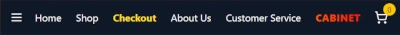
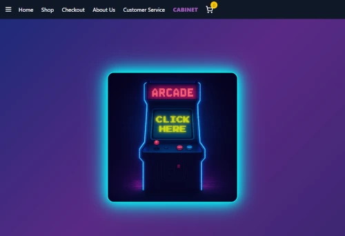
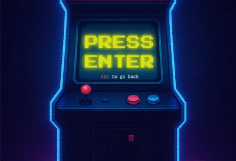
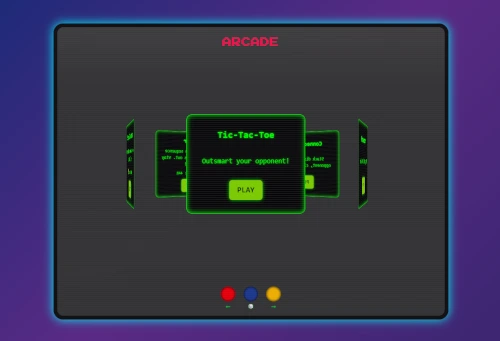

# 🕹️ Arcade Cabinet Experience

This is a practice project **built with React**, designed as a fictional e-commerce website with a hidden interactive twist.

> **Technologies used**:  
> **React**, **Redux**, **Framer Motion**, **Keen Slider**, **Tailwind CSS**, **Custom CSS** (CRT and scanline effects), **LocalStorage** (track unlocked games)

- **Keen Slider**  
  [https://keen-slider.io/examples](https://keen-slider.io/examples)  
  A lightweight and responsive touch slider with full control, used for the 3D game carousel inside the cabinet.

While browsing the store, users can find and unlock secret mini-games hidden throughout the site.

Each discovered game is saved in the `localStorage`.

Once **3 or more games** are unlocked, a new link appears in the navigation bar: `Cabinet`.



## The Arcade Cabinet

An immersive, retro-style gaming experience with animated transitions, audio feedback, and a 3D carousel of unlockable mini-games inside a CRT-like arcade screen.

### Cabinet Flow

1. **Idle Stage**  
   A glowing **"CLICK HERE"** prompt invites the user to interact with the arcade cabinet image.

   

2. **Zoom Stage**  
   The camera zooms in on the screen. Press `ENTER` to proceed or `ESC` to return.

   

3. **Enter Stage**  
   A smooth transition simulates entering the cabinet with blur and scale effects.

4. **Cabinet View**  
   Inside the screen, the games are shown in a rotating **3D carousel** using **Keen Slider**.

   

### Cabinet Features

- 🎮 Only unlocked mini-games appear in the carousel
- 🌀 3D carousel with rotation and sound feedback
- 💡 CRT scanline + flicker effects for retro realism
- 🔊 Sound effects for navigation and interaction
- 🎲 Random game selector and navigation buttons
- 🏆 High scores per game (optional if implemented)

---

## 🎮 Built-in Games

Each game is a **React component** rendered dynamically when selected from the cabinet carousel.

> 🔧 The base project includes only the import logic — actual game components are **not provided**, so you can plug in your own!

> Inside your **Redux slice** you can register your own information.

## Getting Started

To run the project locally:

```bash
git clone https://github.com/andreamarciano/cabinet-v1
cd cabinet-v1
npm install
npm start
```
